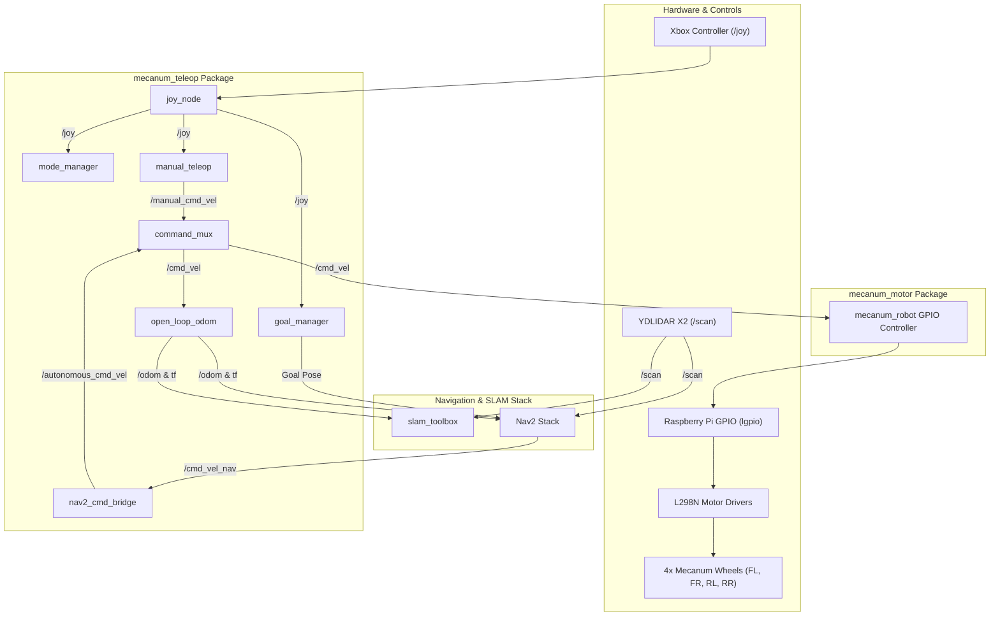

# AMR-SIH: Autonomous Mobile Robot (Mecanum Wheel System)

An industrial-grade ROS 2 workspace designed for 4-wheel **Mecanum Autonomous Mobile Robots (AMR)**. Built for hardware execution on Raspberry Pi with **lgpio** motor control, **YDLIDAR X2** LiDAR scanning, **SLAM Toolbox** mapping, and **Nav2** autonomous navigation with Xbox controller teleoperation.

---

## 📐 System Architecture

### Control & Navigation Pipeline



---

## 📁 Repository Structure

```
AMR-SIH/
├── .gitignore
├── README.md
├── mobile_base_1 step.STEP     # 3D CAD STEP model of the AMR mobile base
└── mecanum_ws/
    └── src/
        ├── mecanum_bringup/          # Bringup package for total robot launch
        │   ├── package.xml
        │   ├── setup.cfg
        │   └── setup.py
        ├── mecanum_camera/           # Camera sensor integration package
        │   ├── package.xml
        │   ├── setup.cfg
        │   └── setup.py
        ├── mecanum_description/      # URDF / Xacro kinematics & simulation models
        │   ├── CMakeLists.txt
        │   ├── LICENSE
        │   ├── package.xml
        │   ├── config/
        │   │   └── mecanum_drive_controller.yaml
        │   ├── launch/
        │   │   ├── mecanum_display.launch.py   # RViz visualization
        │   │   └── mecanum_gazebo.launch.py    # Gazebo Ignition simulation
        │   ├── rviz/
        │   │   └── mecanum.rviz
        │   ├── scripts/
        │   │   └── autonomous_mode.py
        │   └── urdf/
        │       └── mecanum_robot.urdf.xacro    # 4-wheel Mecanum URDF model
        ├── mecanum_motor/            # Low-level hardware GPIO motor driver node
        │   ├── package.xml
        │   ├── setup.cfg
        │   ├── setup.py
        │   └── mecanum_motor/
        │       └── mecanum_robot.py  # L298N GPIO motor control with lgpio & Watchdog
        ├── mecanum_teleop/           # Control multiplexer, mapping, Nav2 bridge & teleop
        │   ├── package.xml
        │   ├── setup.cfg
        │   ├── setup.py
        │   ├── config/
        │   │   └── nav2_params.yaml  # Costmaps, planner, and controller params
        │   ├── launch/
        │   │   ├── mecanum_control.launch.py    # Hardware control, joy, mux & motor driver
        │   │   ├── mecanum_mapping.launch.py    # YDLIDAR + Open-loop odom + SLAM Toolbox
        │   │   └── mecanum_navigation.launch.py # Nav2 bringup + cmd_vel bridge
        │   ├── maps/
        │   │   ├── warehouse.pgm     # Saved occupancy grid map image
        │   │   └── warehouse.yaml    # Map metadata & resolution parameters
        │   └── mecanum_teleop/
        │       ├── goal_manager.py      # Waypoint / goal manager using Xbox buttons
        │       ├── joystick_ab.py       # Xbox controller axes & buttons handler
        │       ├── mecanum_control.py   # Mode Manager, Teleop, & Command Mux nodes
        │       ├── nav2_cmd_bridge.py   # Nav2 velocity remapper (/cmd_vel_nav -> /autonomous_cmd_vel)
        │       ├── open_loop_odom.py    # Kinematic odometry publisher (odom -> base_link)
        │       └── teleop_ab.py         # Holonomic velocity calculator
        └── robot_motor/              # Supplementary motor driver configuration
            ├── package.xml
            ├── setup.cfg
            └── setup.py
```

---

## ⚡ Hardware Configuration & Pinout

The physical motor control utilizes Raspberry Pi 4/5 GPIO pins connected to **L298N Dual H-Bridge Motor Drivers** managing 4 Mecanum wheels:

| Wheel Position | Forward Pin (IN1) | Reverse Pin (IN2) | Driver Channel |
| :--- | :---: | :---: | :---: |
| **Front-Left (FL)** | GPIO 17 | GPIO 18 | Driver 1 - Ch A |
| **Front-Right (FR)** | GPIO 22 | GPIO 23 | Driver 1 - Ch B |
| **Rear-Left (RL)** | GPIO 24 | GPIO 25 | Driver 2 - Ch A |
| **Rear-Right (RR)** | GPIO 5 | GPIO 6 | Driver 2 - Ch B |

---

## 🎮 Xbox Controller Button Mapping

| Button | Mode / Action | Description |
| :---: | :--- | :--- |
| **A** | `MANUAL` Mode | Enables direct omnidirectional manual joystick control |
| **B** | `AUTONOMOUS` Mode | Switches to Nav2 autonomous navigation control |
| **X** | `STOP` Mode | Emergency stop mode (halts all 4 motors immediately) |
| **Y** | Save Goal Pose | Saves current position as navigation target |
| **START** | Save Start Pose | Saves current position as navigation home |

---

## ⚙️ Mecanum Kinematics Equations

The holonomic velocity matrix maps linear velocities ($v_x, v_y$) and angular velocity ($\omega$) to wheel speeds:

$$
\begin{bmatrix} v_{fl} \\ v_{fr} \\ v_{rl} \\ v_{rr} \end{bmatrix} = \begin{bmatrix} 1 & 1 & 1 \\ 1 & -1 & -1 \\ 1 & -1 & 1 \\ 1 & 1 & -1 \end{bmatrix} \begin{bmatrix} v_x \\ v_y \\ \omega \end{bmatrix}
$$

---

## 🚀 Setup & Execution Guide

### Prerequisites
- **OS**: Ubuntu 22.04 LTS (or Raspberry Pi OS 64-bit)
- **ROS 2 Version**: Humble / Iron / Jazzy
- **Hardware Drivers**: `lgpio` Python library (`sudo apt install python3-lgpio`)
- **ROS Packages**:
  ```bash
  sudo apt update
  sudo apt install -y \
      ros-$ROS_DISTRO-joy \
      ros-$ROS_DISTRO-teleop-twist-joy \
      ros-$ROS_DISTRO-slam-toolbox \
      ros-$ROS_DISTRO-navigation2 \
      ros-$ROS_DISTRO-nav2-bringup \
      ros-$ROS_DISTRO-ydlidar-ros2-driver
  ```

### Build Instructions
```bash
# Navigate to workspace root
cd ~/AMR-SIH/mecanum_ws

# Build all packages with symlink-install
colcon build --symlink-install

# Source the workspace environment
source install/setup.bash
```

---

### Launching System Operations

#### 1. Hardware Motor Control & Joystick Multiplexer
Launches Xbox Joystick node, Mode Manager, Manual Teleop node, Goal Manager, Command Mux, and L298N GPIO Motor Driver.
```bash
ros2 launch mecanum_teleop mecanum_control.launch.py
```

#### 2. SLAM Mapping (Environment Mapping)
Launches YDLIDAR X2 driver, Open Loop Kinematic Odometry node, and Async SLAM Toolbox.
```bash
ros2 launch mecanum_teleop mecanum_mapping.launch.py
```

#### 3. Nav2 Autonomous Navigation
Launches Nav2 stack with pre-configured parameters and goal command bridge.
```bash
ros2 launch mecanum_teleop mecanum_navigation.launch.py map:=src/mecanum_teleop/maps/warehouse.yaml
```

#### 4. URDF Model Visualization in RViz
```bash
ros2 launch mecanum_description mecanum_display.launch.py
```

#### 5. Gazebo Physics Simulation
```bash
ros2 launch mecanum_description mecanum_gazebo.launch.py
```

---

## 🛡️ Safety Watchdog & Timeout
The motor driver node (`mecanum_robot`) includes a 0.5-second watchdog timer:
- In **MANUAL** mode: Automatically stops motors if `/joy` messages stop arriving within 500ms.
- In **AUTONOMOUS** mode: Automatically stops motors if `/cmd_vel` messages stop arriving within 500ms.

---

## 📄 License
This repository is licensed under the Apache License 2.0.
